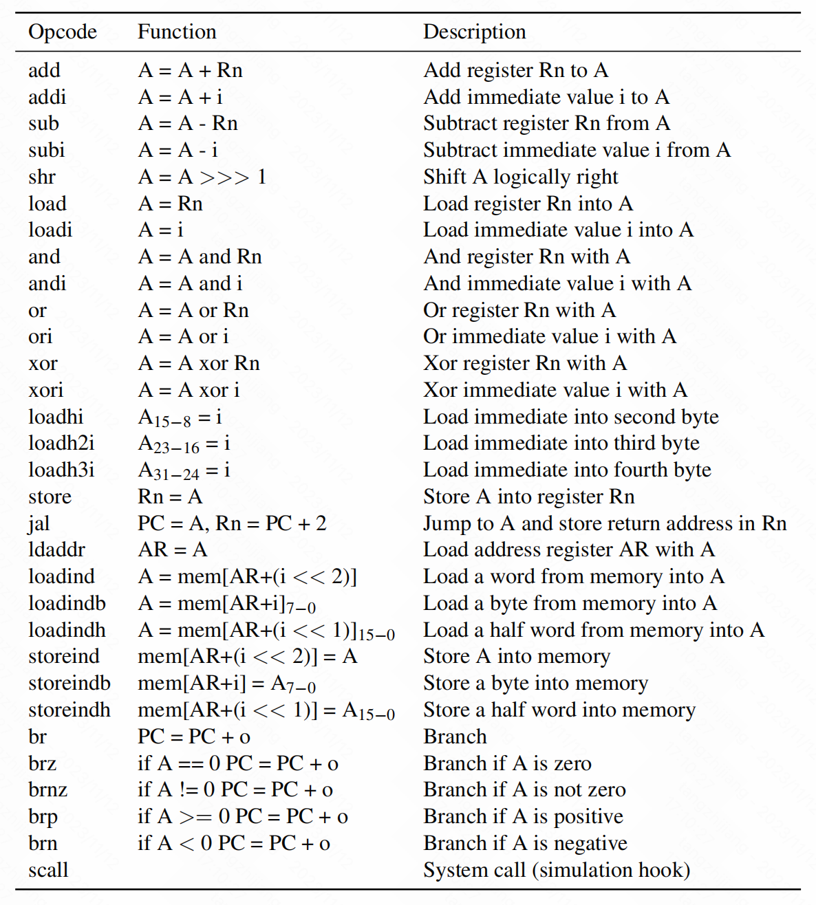
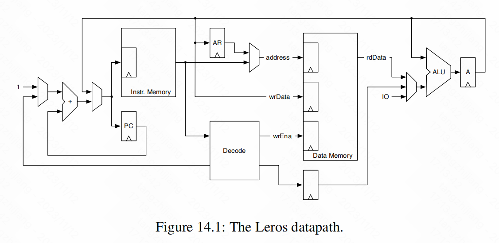

# Chapter 14:Design of a Processor

本书最后提出了一个中等规模的项目：微处理器的设计、模拟和测试。为了保持这个项目易于管理，我们设计了一个简单的simple accumulator machine被称为Leros，可以在https://github.com/leros-dev/leros上通过开源方式获取。

### 14.1 The Instruction Set Architecture

Chisel-Book自己设计的指令体系，与RISC-V架构不同

