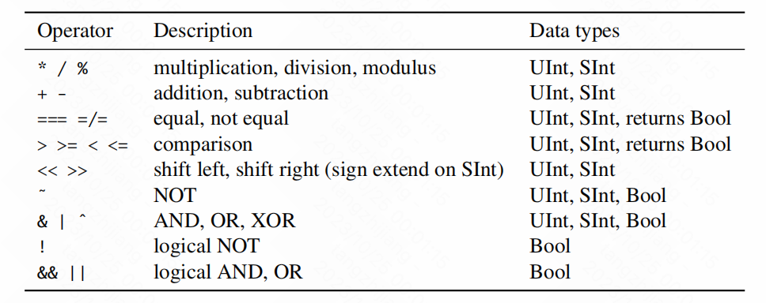

# Chapter 2:Basic Components

### 2.1 Chisel Types and Constants


```scala
Bool()
Bits(8.W)   //比特
Uint(8.W)    //无符号整数
SInt(10.W)   //有符号整数

3.U(4.W)   //位宽为4，默认值为3

"hff".U           //十六进制的255
"o377".U          //8进制的255
"b1111_1111".U    //2进制的255

val aChar = 'A'.U  //ASCII编码下的数字
true.B.    //为真的布尔数

```


### 2.2 Combinational Cricuits

