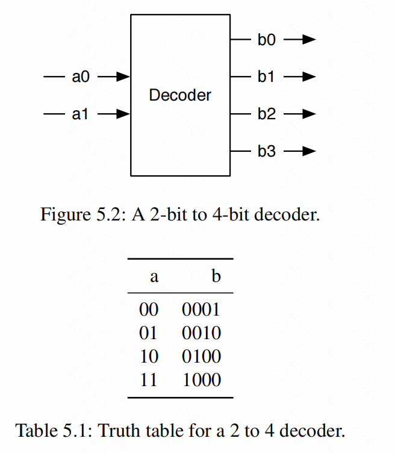
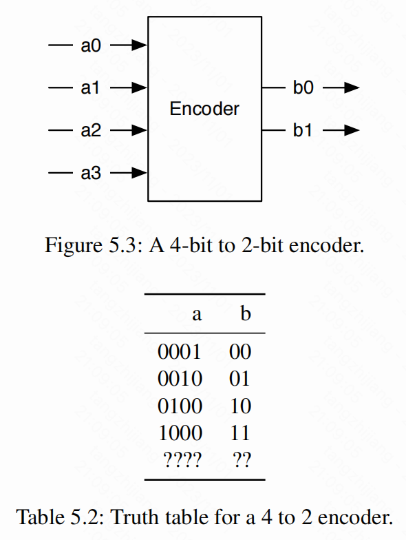
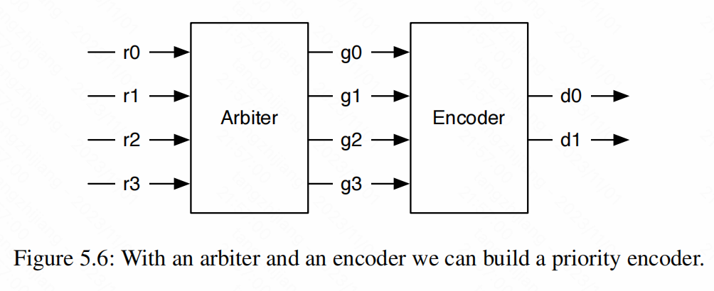

# Chapter 5:Combinational Building Blocks

### 5.1 Combinational Circuits


Chisel还支持描述带有条件更新的组合电路。这样的电路被声明为```Wire```

```scala
val w = Wire(UInt())
when(cond1){
  w := 1.U
}.elsewhen(cond2){
  w := 2.U
}.otherwise{
  w := 3.U
}

val w = WireDefault(0.U)    //定义wire初值
```


### 5.2 Decoder

解码器（Decoder）将一个数n解码成一个m位的信号，输出位一个one-hot编码的数。示意图如下：



```scala
result := 0.U
switch(sel){
  is(0.U){result := 1.U}
  is(1.U){result := 2.U}
  is(2.U){result := 4.U}
  is(3.U){result := 8.U}
}

result := 1.U << sel  //或者将1左移sel个位
```


### 5.3 Encoder



```scala
result := 0.U
switch(a){
  is(1.U){result := 0.U}
  is(2.U){result := 1.U}
  is(4.U){result := 2.U}
  is(8.U){result := 3.U}
}

//可以使用for循环为W连续赋值

```


### 5.4 Arbiter

Arbiter由多个requsts输入和多个grant输出组成。Arbiter只会输出一位比特。例如，输入0101的请求将导致输出0001输出。因此，称之为priority arbiter。比特位越低，优先级越高。

```scala
val grant = WireDefault("b0000".U(3.W))
switch(request){
  is(b"000".U){grant := "b000".U}
  is(b"001".U){grant := "b001".U}
  is(b"010".U){grant := "b010".U}
  is(b"011".U){grant := "b001".U}
  is(b"100".U){grant := "b100".U}
  is(b"101".U){grant := "b001".U}
  is(b"110".U){grant := "b010".U}
  is(b"111".U){grant := "b001".U}
}
```


### 5.5 Priority Encoder




