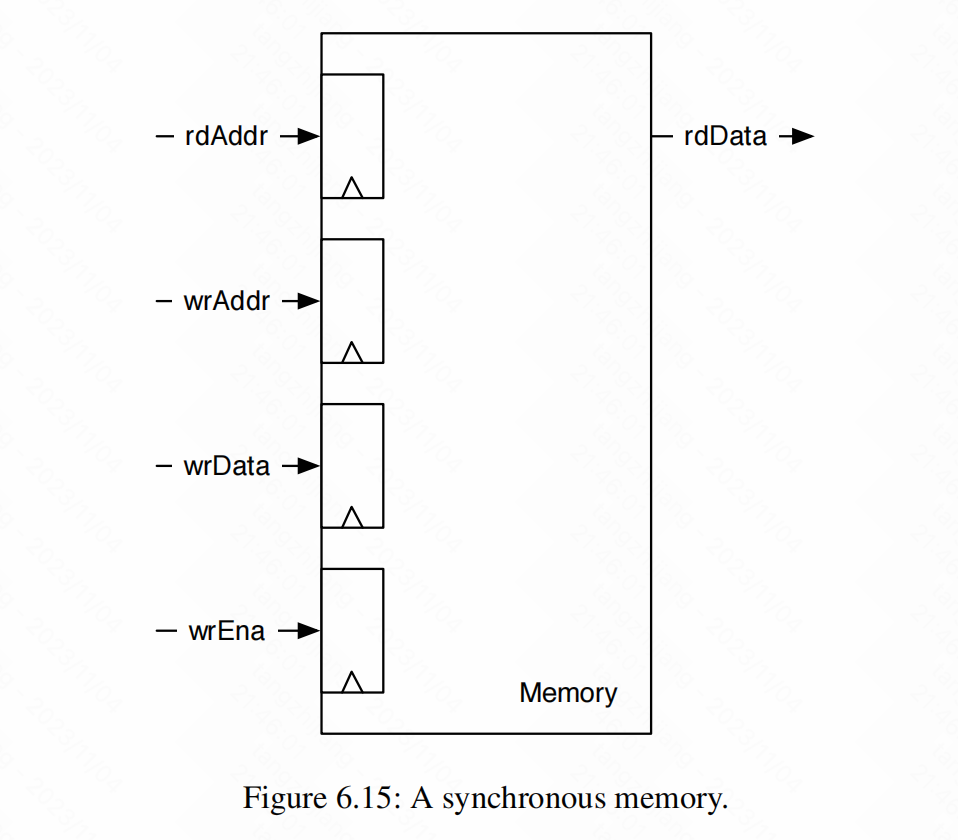

# Chapter 6:Sequential Building Blocks


### 6.1 Registers

为了实现状态的存储需要使用到寄存器


```scala
val a = RegNext(d)         //d的寄存器
val a = Reg(UInt(4.W))     //定义一个寄存器
val a = RegInit(UInt(4.W),0.U)   //定义一个有初始值的寄存器
val a = RegEnable(d,enable) //可写寄存器，当enable=true时，a=d


//可以将三种寄存器结合起来
val a = RegEnable(d, 0.U,enable)
```


### 6.2 Counters

```scala
val cntEventsReg = RegInit(0.U(4.W))
when(event){
  cntEventsReg := cntEventsReg+1.U
}
```


##### 6.2.1 Counting Up and Down

往上计数和往下计数

##### 6.2.2 Generating Timing with Counters

可以用计数器来计时

##### 6.2.3 The Nerd Counter


### 6.3 Shift Registers

移位寄存器是按顺序连接的寄存器的集合。一个寄存器的每个输出端都连接到下一个触发器的输入端。


```scala
val shiftReg = Reg(UInt(4.W))
shiftReg := shiftReg(2,0)
val out = shiftReg(3)
```


### 6.4 Memory

一个存储器可以有一系列的Registers组成，但这样构建的储存器成本是很高的。一个更好的储存结构叫做SRAM，这种组件有更大的存储空间。

同步内存结构四个参数，该内存是双端口的，带有一个读端口和一个写端口。读端口有一个输入，读地址（rdAddr）和一个输出（rdData）。写端口有三个输入：地址（wrAddr）、要写入的数据（wrData）和启用写入（wrEna）。

```scala

//1 KiB的同步内存
class Memory() extends Module{
  val io=IO(new Bundle){
    val rdAddr = Input(UInt(10.W))
    val rdData = Output(UInt(8.W))
    val wrAddr = Input(UInt(10.W))
    val wrData = Input(UInt(8.W))
    val wrEna = Input(Bool())
  }
  val mem = SyncReadMem(1024,UInt(8.W))
  io.rdData := mem.read(io.rdAddr)
  when(io.wrEna){
    mem.write(io.wrAddr,io.wrData)
  }
}
```

