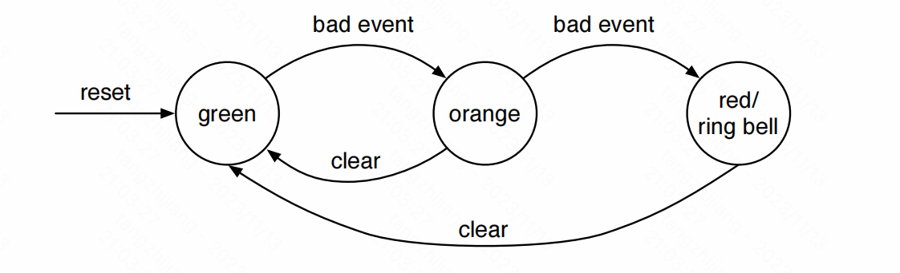

# Chapter 8:Finite-State Machines(FSM)

有限状态机（FSM）是digital design中的一个基本组成部分。一个FSM可以被描述为一组state和状态之间的条件（保护）state transitions。

FSM的实现需要三部分：

- registers保存状态
- 组合逻辑基于现在的状态计算下一步状态
- 组合逻辑计算FSM的输出

### 8.1 Basic FSM

简单的状态机示例




```scala
import chisel3._
import chisel3.util._
class SimpleFsm extends Module {
  val io = IO(new Bundle{
    val badEvent = Input(Bool ())
    val clear = Input(Bool ())
    val ringBell = Output(Bool ())
  })
  
  
  //可以学习！！！
  // The three states
  object State extends ChiselEnum {
    val green , orange , red = Value
  }
  import State._
  
  // The state register
  val stateReg = RegInit(green)
  // Next state logic
  switch (stateReg) {
    is (green) {
      when(io.badEvent ) {
        stateReg := orange
      }
    }
    is (orange) {
      when(io.badEvent ) {
        stateReg := red
      } .elsewhen(io.clear) {
        stateReg := green
      }
    }
    is (red) {
      when (io.clear) {
        stateReg := green
      }
    }
  }
  // Output logic
  io. ringBell := stateReg === red
}
```


### 8.2 Faster Output with a Mealy FSM

