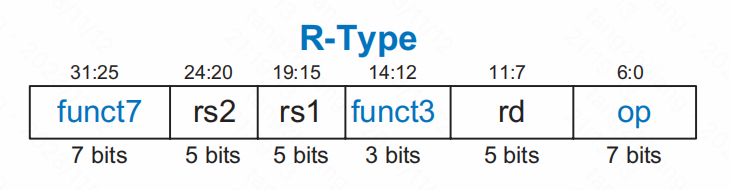
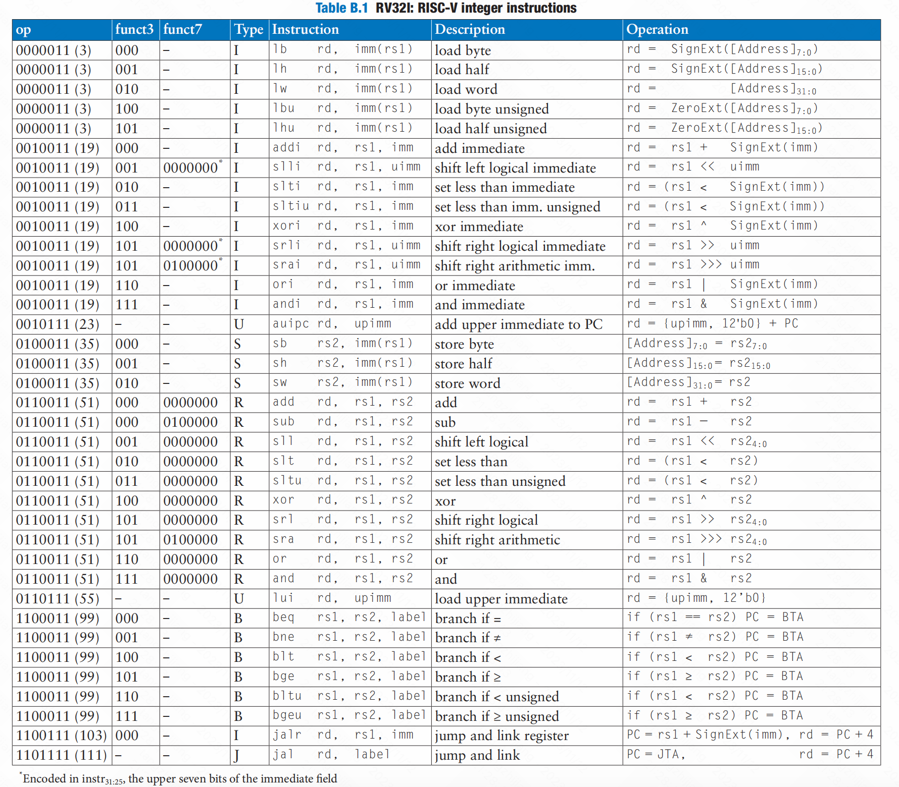
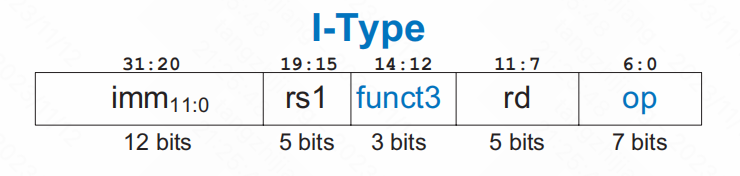
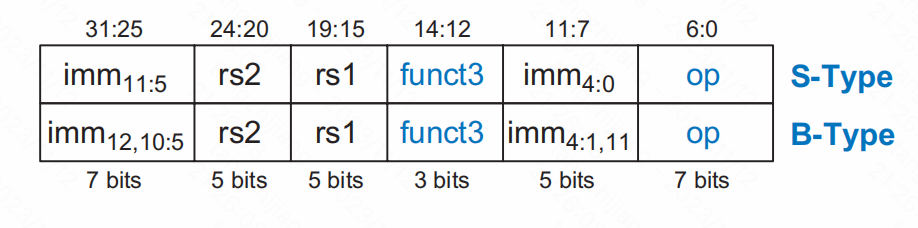
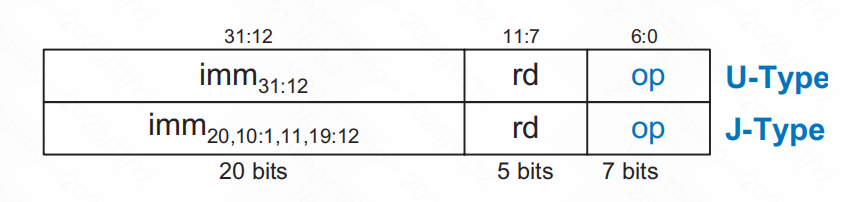

# Chapter 6:Architecture

### 6.1 Introduction

### 6.2 Assembly Language（汇编语言）

##### 6.2.1 Instructions（指令）


##### 6.2.2  Operands: Registers, Memory, and Constants


###### Registers set（寄存器集）

指令需要快速访问操作数，以便它们能够快速运行，但是存储在内存中的操作数需要很长时间才能检索。因此，大多数架构都指定了少量的寄存器，它保存常用的操作数。RISC-V有32个寄存器，被称为寄存器集，存储在一个被称为 *register file*（寄存器文件）的小的多端口内存中。寄存器越少，速度就越快 它们可以被访问。

下表列出了32个RISC-V寄存器的名称和使用情况。寄存器的编号为0到31，*zero*寄存器始终保持常量0。寄存器*s0-s11*（寄存器8-9和18-27）和*t0-t6*（寄存器5-7和28-31）用于存储变量；*ra*和*a0-a7*在函数调用期间有特殊用途。寄存器2到4也被称为sp、gp和tp，并将在后面进行描述。


###### Constants/Immediates（常数/即可数）

除了寄存器操作之外，RISC-V指令还可以使用常数或直接操作数。这些常量被称为即时性，因为它们的值可以立即从指令中获得 文件和不需要寄存器或内存访问。添加即时指令addi，添加即时到寄存器。即时性是12位2的补码数，被符号扩展到32位。

要创建更大的常量，请使用 *load upper immediate （lui）*，然后使用*add immediate instruction (addi)*。*lui*指令会立即加载一个20位的指令，进入指令中最重要的20位，并在最不重要的位中放置零。


###### Memory（内存）

通过使用内存和寄存器的组合，一个程序可以相当快速地访问大量的数据。

RISC-V使用*byte-addressable memory*（字节可寻址的内存）。也就是说，内存中的每个字节都有一个唯一的地址。下图所示一个32位字由4个8位字节组成，所以每个字的地址都是4的倍数。


*load word（lw）*将内存中的数据字读取到寄存器中。代码例6.10将位于地址8的存储字2加载到a（s7）。lw指令使用添加到基本寄存器上的偏移量来指定内存地址。回想一下，每个数据字都是4个字节，所以t 他这个单词的地址是单词数的四倍。Word号0在地址0，字1在地址4，字2在地址8，以此类推。

```
lw s7,8(offset)    #  lw 寄存器,地址(偏移量)
```


*store word（sw）* 将数据字从寄存器写入内存。


### 6.3 Programming

##### 6.3.1 Program Flow

##### 6.3.2 Logical, Shift, and Multiply Instructions

###### Logical Instructions


###### Shift Instructions


###### Multiply Instructions


##### 6.3.3 Branching


###### Conditional Branches

RISC-V指令集有六个条件分支指令，每个分支指令都有两个源寄存器和一个指示要去哪里的标签。

- beq (*branch if equal*) 
- bne (*branch if not equal*) 
- blt (*branch if less than*)，处理有符号数
- bge (*branch if greater than or equal to)，处理有符号数*
- bltu，处理无符号数
- bgeu，处理无符号数


以下代码的流程为，当程序到达分支时，如果指令s0==s1。执行的下一个指令就是标签target之后的指令。不执行分支和标签之间的指令。


###### Jumps


### 6.4 Machine Language


##### 6.4.1 R-Type Instructions

R类型指令指定了三个寄存器，rs1、rs2为原始寄存器，rd为目标寄存器。32位码有六个区域。

具体的R类型指令由op、funct3、funct7决定

- 7位op（也称为 opcode or operation code，操作码）
- 7位和3位 **funct7** and **funct3**

例如，add指令操作码和函数字段是op = 51（0110011）、funct7=0（0000000）和funct3=0（000）。类似地，sub指令有op = 51，函数7=32（0100000） ，和函数为3=0（000）。两个源寄存器和目标寄存器被编码在三个字段中： rs1、rs2、 和rd。






##### 6.4.2 I-Type Instructions

I类型（*immediate*）指令使用两个寄存器操作数和一个直接操作数。I指令包括addi、andi、ori和xori、load（lw、lh、lb、lhu和lbu）和寄存器跳转(jalr ).



##### 6.4.3 S/B-Type Instructions

与I类型指令一样，S/B类型（*store/branch*）指令使用两个寄存器操作数和一个直接操作数。然而，这两个寄存器操作数都是S/B-中的源寄存器（rs1和rs2） 类型，而I-type指令使用一个源寄存器（rs1）和一个目标寄存器（rd）。




##### 6.4.4 U/J-Type Instructions

U/J型（*upper immediate/jump*）指令具有一个目标寄存器操作数rd和一个20位直接字段，如图6.23所示。与其他格式一样，U/j类型的指令也有一个7位的op 编码在u型指令中，其余的位指定了32位直接位中最重要的20位。在j型指令中，其余的20位指定了a中最重要的20位 21位即时跳跃偏移。与b型指令一样，直接指令的最小有效位总是0，并且没有在j型指令中编码。


