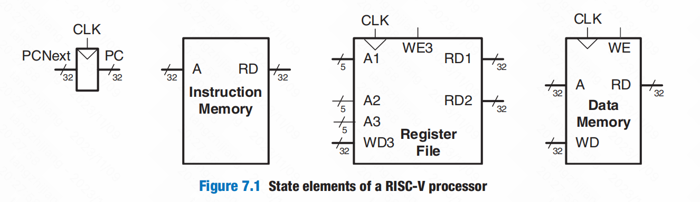

# Chapter 7:Microarchitecture

### 7.1 Introduction

##### 7.1.1 Architectural State and Instruction Set

为了保持微架构易于理解，只专注于RISC-V指令集的一个子集。具体来说，处理以下指令：

- R-type instructions: *add, sub, and, or, slt*
- Memory instructions: *lw, sw*
- Branches: *beq*

##### 7.1.2 Design Process

我们将微架构分为两个相互作用的部分：*data path（数据路径）* and the *control unit（控制单元）*

##### 7.1.3  Microarchitectures

在本章中，我们为RISC-V体系结构开发了三种微体系结构：单周期、多周期和流水线化。它们的区别在于状态元素的连接方式和n的数量 所需的建筑状态。

The *single-cycle microarchitecture*（单周期微架构）在一个周期内执行整个指令。它易于解释，并有一个简单的控制单元。因为它完成了这个操作 在一个周期中，它不需要任何非架构状态。然而，周期时间受到最慢的指令的限制。此外，该处理器还需要单独的指令和数据存储器， 这通常是不现实的。

The *multicycle microarchitecture* （多循环微架构）在一系列较短的周期内执行指令。更简单的指令比复杂的指令执行的周期更少。此外，多循环微体系结构通过重用硬件块，如adder和memory来降低硬件成本。多周期微处理器通过引入几个非架构寄存器来保持中间结果来实现这一点。多循环处理器 一次只执行一条指令，但每条指令都需要多个时钟周期。这个处理器只需要一个内存，在一个周期内访问它来获取指令 其他的是读取或写数据。因为它们比单周期处理器使用的硬件更少，所以多周期处理器是廉价系统的历史选择。

The *pipelined microarchitecture* （流水线式微架构） 通过管道到单周期微体系结构。因此，它可以同时执行多个指令，从而显著地提高了吞吐量。管道必须添加逻辑来处理指令间的关系。它还需要非体系结构的管道寄存器。管道处理器必须在同一周期内访问指令和数据；为达到此目的，使用单独的指令和数据缓存。增加的逻辑和寄存器是值得的；今天所有的商业高性能处理器都使用流水线。

### 7.2 Performance Analysis

### 7.3 Singl-Cycle Processor

##### 7.3.1 Sample Program

##### 7.3.2 Single-Cycle Datapath

[补码/反码、零扩展和符号位扩展（Zero extension and Sign extension）](https://blog.csdn.net/weixin_40539125/article/details/103058420)

##### 7.3.3 Single-Cycle Control

