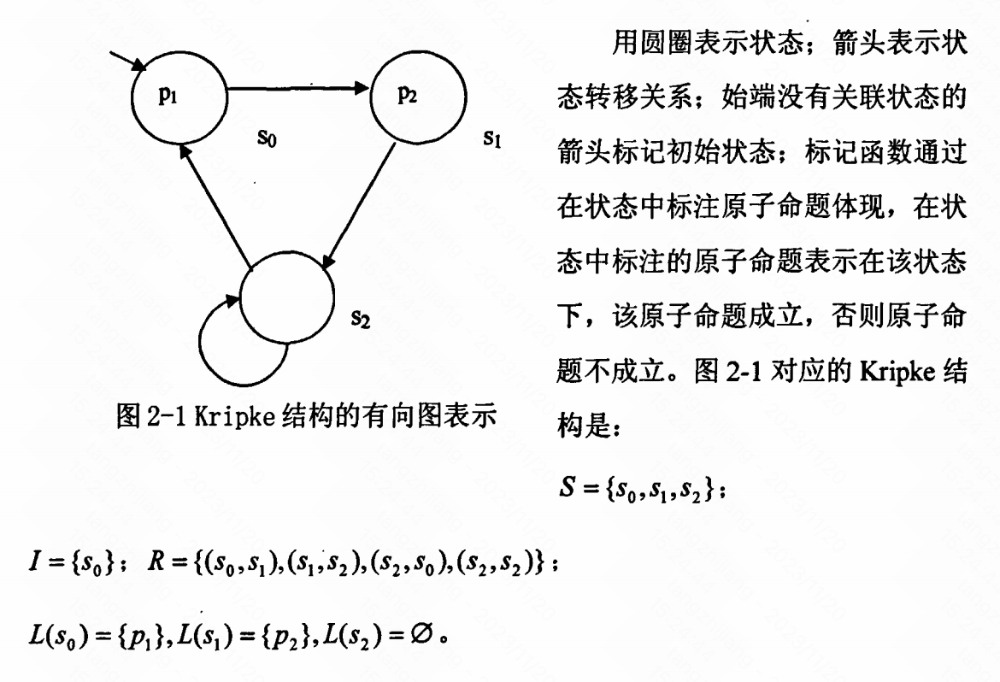

# $Model Checking

模型检测（model checking）一种自动验证有限状态转移系统是否满足规范（specification）的形式化方法。形式化验证框架有三个基本元素：特验证系统的数学模型，描述规范的形式语言和确立数学模型是否满足规范的验证方法。$$

在模型检测中，数学模型是有限状态转移系统；描述规范的形式语言使用时态逻辑（如计算数时态逻辑CTL、线性时态逻辑LTL等）；验证方法是穷尽搜索有限状态转移系统的每一个状态，给出系统模型是否满足规范的结论。

最初模型检测是通过显式地分析和存储有限状态转移系统的每一个状态实现。这种方法会遇到状态爆炸的问题，状态爆炸问题限制了模型检测在实际中的应用。符号模型检测（Symbolic Model Checking）的引入缓解了状态爆炸问题，符号模型检测借助有序二叉决策图（Ordered Binary Decision Diagrams，OBDD）处理状态集合而不是单个状态。

## 1.系统模型（Kripke结构）

Kripke结构是一个四元组$M=(S,I,R,L)$：

- $S$是所有状态的有限集合
- $I$为初始状态集合
- $R \subseteq  S\times S$ ，表示状态转移关系
- $L:S \to 2^{AP}$是一个标记函数（$AP$为原子命题集合）

### 2.1 布尔函数表示

Kripe状态转换图显式地表示系统模型的状态和状态转换关系，会出现状态爆炸问题，符号模型检测在一定程度可以缓解该问题，其主要思想是将状态（集合）和状态转换（集合）用布尔函数表示，通过布尔函数运算来完成状态集合之间的运算。

布尔函数有很多种方法，如真值表、析取范式、命题公式、BDD等。BDD表示能在存储空间和运算复杂度间找到一种平衡。

##### 2.1.1 

##### 2.1.2 有序二叉决策树（Ordered Binary Decision Diagram, OBDD）

二叉决策树BDD式布尔公式的一种表示方法，是一个具有唯一初始结点的有向无环图，所有终端节点标记为0或1，所以非终端节点用布尔变量标记。

###### 用布尔函数表示状态（集合）

###### 用布尔函数表示状态转换（集合）

## 2.时态逻辑

### 2.1 线性时态逻辑LTL

LTL将时间建模为状态的状态，任一当前时刻仅存在唯一的可能未来时刻。状态的序列成为路径。

LTL常用的时态算子：

- $X$，
- $G$
- $F$
- $U$
- $R$
- $W$

#/## 2.2 计算树逻辑CTL

CTL将时间建模为一个树状结构，任一当前时刻可能分叉为多种可能未来时刻。

